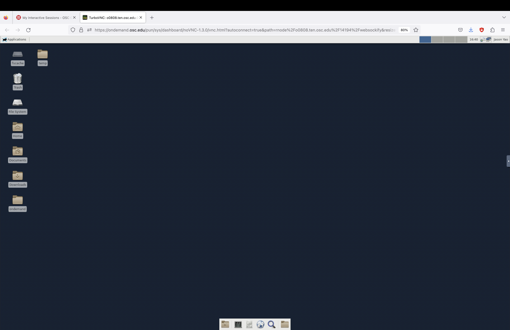

How to: Getting Started  [#f1]_
================================

Following `Diátaxis <https://diataxis.fr/how-to-guides/>`_, this section is
designed to be a collection of how-to guides.

.. _a21:

How to obtain an OSC account [#f2]_
------------------------------------
The commercial antenna simulation software that we use (XFdtd) is installed on
OSC. If you are associated with the Ohio State University, you can email or talk
to Dr. `Connolly <connolly@physics.osu.edu>`_ to obtain an Ohio Supercomputer
Center (OSC) account. Please include the following information in your email:

*   Your first and last name
*   Your date of birth
*   Your e-mail address
*   Your phone number

Once you request access, you'll receive an email stating you've been invited to
join the project, ``PAS1960`` (Our project space on OSC is at
``/fs/ess/PAS1960``). You can then follow the link provided in the email to
register your account.
If you don't already have an OSC account, you'll also receive an email telling
you that a request has been made on your behalf, and it will ask you to verify
your email address.

You should also ask Dr. Connolly to add you to our :ref:`XFdtd <a2xfdtd>`
license. Please fill out the 
:download:`OSC Software License Agreement form <osc_sla.pdf>` and email it to
Dr. Connolly.

.. -----------------------------------------------------------------------------
.. _a22:

How to connect to OSC [#f3]_
-----------------------------
If you're running Windows :strike:`consider getting an operating system that
doesn't suck`, you will need to set up Bash to work on Windows first.

..  todo::

    how to set up Bash on Windows?

If you're running macOS or Linux, simply open the terminal application and type
the following command to "ssh into OSC":

..  code-block:: Bash

    ssh -XY your_username@pitzer.osc.edu

This will let you access OSC's `Pitzer cluster
<https://www.osc.edu/resources/technical_support/supercomputers/pitzer>`_.
Alternatively, you could access the `Owens cluster
<https://www.osc.edu/resources/technical_support/supercomputers/owens>`_ through

..  code-block:: Bash

    ssh your_username@owens.osc.edu

(``-XY`` is an ``option`` of the command ``ssh``; more on this `here
<https://www.microfocus.com/documentation/rsit-server-client-unix/8-4-0/unix-gui
de/ssh_options_ap.html>`_.)
Note that the terminal is not going to display your password as you type it,
it is not going to even show hints on how many characters you have entered,
such as ``****``.

To cancel logging into OSC, press the keys :kbd:`Control` + :kbd:`c`

Once you are in, you may close the connection to OSC with :kbd:`Control` + 
:kbd:`d`

.. -----------------------------------------------------------------------------
.. _a23:

How to set up Bash read command [#f4]_
---------------------------------------

Once you are on OSC, you may want to proceed to set up your ``.bashrc`` file.

To do so, ``cd`` (change directory) to your home directory if you are not
already there:

..  code-block:: Bash

    cd ~

Here you may wish to also print out where your home directory is with the
command ``pwd`` (print working directory), which is most likely going to be
``/users/PAS1960/your_username``.

If you now list ``a``\ ll files in your home directory through ``ls -a``,
you should see a Bash read command file, or ``.bashrc`` (but worry not if it is
not there). Basically, this is a Bash script that a computer runs every time you
open up the terminal if you are using Bash. 

..  note::

    If you are somehow using other "shells" to interact with the operating
    system, for example *zsh*, then you would have a corresponding ``.zshrc``
    file.

..  _a23vim:

tutorial: your new favorite editor
^^^^^^^^^^^^^^^^^^^^^^^^^^^^^^^^^^^

In the terminal, open or create your own ``.bashrc`` using the text editor 
*Vim* through

..  code-block:: Bash

    vim ~/.bashrc

If this is your first time using Bash and Vim, congratulations, you are now
editing your first ever Bash script, a widely used scripting language, via `a
widely used editor <https://www.vim.org/>`_, and the first thing you will notice
is that you can't actually type anything; you probably can't even ``q``\ uit the
editor to go back to the terminal window; incidentally, this has over the years
become a meme among Vim users. That you can't type as you normally could is 
because you are in what is known as the ``normal`` mode.  Hit :kbd:`i` to get
into ``insert`` mode; you should see **-- INSERT --** in the bottom left corner.
Now, you will be able to type normally. To exit the ``insert`` mode, press
:kbd:`esc` on your keyboard, and you will be back in the ``normal`` mode. In
``normal`` mode, hit :kbd:`:+w+q+Enter` to save what you typed and quit;
alternatively, hit :kbd:`:+q+!+Enter` to force quit Vim without saving.

Now that you have started using Vim, you might want to check out the offline
tutorial by typing ``vimtutor`` in the terminal. For more advanced `tips and
tricks <https://www.youtube.com/watch?v=bQfFvExpZDU>`_ to speed up your typing, 
you are also encouraged to watch `tutorials
<https://www.youtube.com/watch?v=qZO9A5F6BZs&t=504s>`_ on the internet.

..  warning::

    In two months it will start feeling painful whenever you *cannot* use Vim.

bashrc alias
^^^^^^^^^^^^

You can put any alias to commands in ``.bashrc`` and the computer will
automatically follow these abbreviations each time you open a new terminal
window. For example, suppose you don't want to have to type out

..  code-block:: Bash

    cd /fs/ess/PAS1960/GENETIS_HPol/Evolutionary_loop

In order to go to the ``GENETIS_HPol`` workspace, you could set up an ``alias``:

1.  Open up ``.bashrc`` again using Vim.
2.  In **--Insert--** mode, enter 
    
    ..  code-block:: Bash

        alias hpol='/fs/ess/PAS1960/GENETIS_HPol/Evolutionary_loop'

3.  Save the above change and quit Vim through :kbd:`:+w+q`.
4.  In the terminal, enter ``source ~/.bashrc`` for the ``alias`` to take
    effect. Alternatively, you could close the terminal window and open up
    a new one (``.bashrc`` is automatically sourced when a new terminal is 
    opened).
5.  Now, after the newly edited ``.bashrc`` is ``sourced``, instead of typing
    ``cd /fs/ess/PAS1960/GENETIS_HPol/Evolutionary_loop``, you could simply use
    ``hpol`` to get to the desired directory!

our bashrc
^^^^^^^^^^
The following is the ``.bashrc`` used by the OSU GENETIS team.
Note that this specific ``.bashrc`` is for OSU Connolly group members and will
not work if you do not have access to the PAS1960 project space.

..  todo::

    * Check if ``.bashrc`` is still up-to-date

..  code-block:: Bash

    # .bashrc
    #  Source global definitions
    if [ -f /etc/bashrc ]; then
        . /etc/bashrc
    fi

    #For GENETIS 
    module load gnu/7.3.0
    module load mvapich2/2.3
    module load fftw3
    module load python/3.6-conda5.2
    module load cmake
    export CC=`which gcc`
    export CXX=`which g++`

    #For running ARASim
    source /cvmfs/ara.opensciencegrid.org/v2.0.0/centos7/setup.sh
    source /fs/project/PAS0654/BiconeEvolutionOSC/new_root/new_root_setup.sh

    #Bicone GENETIS directory shortcut alias to PAS1960
    alias GE60='cd /fs/ess/PAS1960/BiconeEvolutionOSC/BiconeEvolution/\
    current_antenna_evo_build/XF_Loop/Evolutionary_Loop/'

.. -----------------------------------------------------------------------------
.. _a2vdi:

How to launch a VDI
-------------------

To "launch a VDI (virtual desktop infrastructure)," visit `OSC OnDemand
<https://ondemand.osc.edu/pun/sys/dashboard>`_. Once you log in, select
"Lighweight Desktop".

..  image:: img/VDI_step1.png
    :width: 850

Then, request the number of hours (please don't actually enter 9999999) and 
hit the blue "Launch" button. 

..  image:: img/VDI_step2.png
    :width: 850

Once the vitual desktop is ready, you should see the blue "launch lightweight
desktop" button. Please note that there will be a delay before this button shows
up; the wait time depends on how much resources (in this case, the number of
hours) you are requesting.

..  image:: img/VDI_step3.png
    :width: 850

..  note::

    It is a GENETIS common practice to share VDI with other team members via the
    ``#vdi_links`` :ref:`Slack channel <a12>` (locked, please ask for permission
    to join the channel). With the shared link, others can view the terminal
    check the status of the currently running loop. To generate a shareable VDI
    link, click the "View Only (Share-able Link)" button.

Once you launch the virtual desktop, your browser will open another tab.

Congratulations, you now know how to access OSC through a perhaps more familiar
interface.

..  warning::

    The VDI will shutdown once the time is up. Make sure you request enough
    time for your work and that you save your progress.

When you are finished with your work, remember to log out:

..  image:: img/VDI_step5.png
    :width: 850

..  image:: img/VDI_step6.png
    :width: 850

Finally, delete the session:

..  image:: img/VDI_step7.png
    :width: 850

.. -----------------------------------------------------------------------------
.. _a2xfdtd:

How to launch XFdtd on OSC [#f5]_
---------------------------------
We use :ref:`XFdtd <ch3_3_xfdtd>` to create antennas and simulate their "gains"
(response to electromagnetic waves) on OSC.
For more information on how to use the software, check out its 
:download:`users guide <XFdtd_Users_Guide.pdf>` or the more in-depth `reference
manual <https://www.scribd.com/doc/237799239/XFdtd-Reference-Manual-pdf>`_.

To launch XFdtd, first :ref:`requested the VDI <a2vdi>` and click on the
terminal icon.

..  image:: img/xflaunch_step1.png
    :width: 850

Inside the terminal, type

..  code-block:: Bash

    module load xfdtd/7.9.2.2

where ``7.9.2.2`` is the latest version on OSC (as of Aug 20, 2023); 
alternatively, use the default version through ``module load xfdtd``.
Next, to launch the XFdtd GUI, type 

..  code-block:: Bash

    xfdtd &

where the ``&`` "backgrounds" the terminal command. You will be prompted to
confirm your license. Once confirmed, you should see the following.

..  image:: img/xflaunch_step2.png
    :width: 850

Incidentally, you might consider checking out the ``Help`` drop-down menu inside
the graphical user interface (GUI) of XFdtd. The "Scripting API documentation"
pertains to the scripting language ``xmacro`` which we use to control the 
software.

..  image:: img/xflaunch_step3.png
    :width: 850

Congratulations, you now know how to launch the XFdtd GUI on OSC!

.. -----------------------------------------------------------------------------

.. ..  rubric:: footnote
.. ..  [#r1]   A REMCOM product that utilizes the finite difference time domain
..             (Fdtd) method to compute the response of simulated antennas.
..             For more information, please see **section 3.3**.

..  todo::

    * reference dissertation Chapter 3.3 

..  rubric:: reference
..  [#f1] Rolla, Julie. Dissertation Appendix A.2
..  [#f2] Rolla, Julie. Dissertation Appendix A.2.1
..  [#f3] Rolla, Julie. Dissertation Appendix A.2.2
..  [#f4] Rolla, Julie. Dissertation Appendix A.2.3
..  [#f5] Rolla, Julie. Dissertation Appendix A. Section A.3.1.2